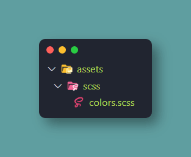

# Utiliser les variables Sass sans les importer manuellement dans chaque composants:
### Source: [dev.to](https://dev.to/paramo/using-sass-global-variables-in-nuxt-js-j0k) or [Hackernoon](https://hackernoon.com/how-i-use-scss-variables-mixins-functions-globally-in-nuxt-js-projects-while-compiling-css-utilit-58bb6ff30438)

- Step 1: Add sass-loader and node-sass to your project

```
using npm:

npm install --save-dev node-sass sass-loader

using yarn:

yarn add --dev node-sass sass-loader
```

- Step 2: Adding the plugin style-resources to your project. If you don't know about plugins take a look in NuxtJS documentation. Also you can review the mentioned plugin right here.
```
using npm:

npm install --save-dev @nuxtjs/style-resources

using yarn:

yarn add --dev @nuxtjs/style-resources
```
- Step 3: Adding to your assets directory a new sccs directory (this is where your global variable files will be stored, you can use as much as you like


And my colors.scss file looks like this

```
$white: #fff;
$black: #000;
$green: #43976c;

/* All the variables you want */
```

- Step 4: Modify your nuxt.config.js file to map the new styles 

```
export default {
    //...
    css: [
    '~assets/scss/colors.scss'
  ],
    //...
    modules: [
    '@nuxtjs/style-resources'
  ],

    //You will have to add this new object if it doesn't exist already
  styleResources: {
    scss: ['./assets/scss/*.scss']
  },
    //...
}
```
We did it!! That's all! 👍 👍 Now we can use our new variables wherever we want without importing anything.
Example:

```
// Don't forget to specify lang="scss"
<style lang="scss" scoped>

.my-css-class {
  width: 90%;
  height: 2px;
  background-color: $green; // Here we are using the variable
  border-radius: 5px;
}

</style>
```